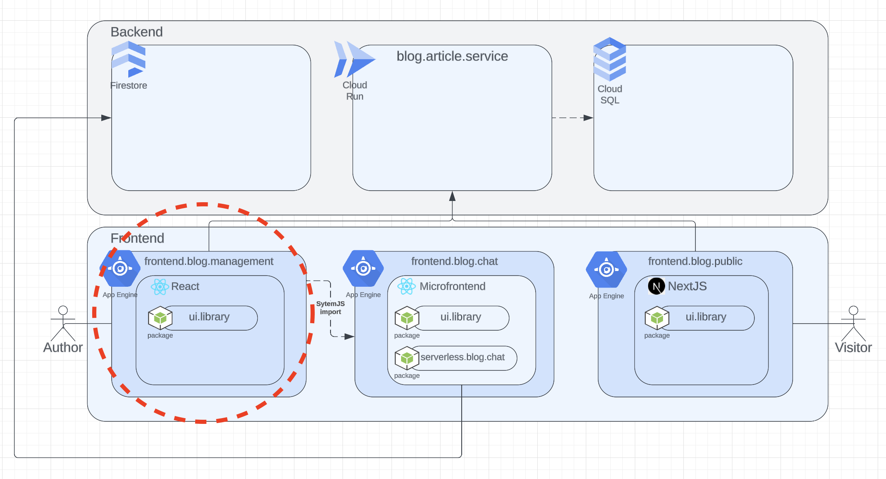

# Frontend Blog Management Application

This application is developed with React for managing a blog. The user interface is created using a custom package based on MUI called "@Confrontend/ui-library". The application also dynamically loads a microfrontend (a chat application).

The application is structured to consume APIs for various actions and uses auto-generated API clients based on OpenAPI specifications. The backend API details can be found in the api/ directory.

## Architecture Big Picture



## File Structure

The application structure is organized as follows:

```yaml
├── api/: API configurations and clients.
│   ├── openapi/: Auto-generated API clients.
├── assets/: Assets like images for readme.
├── dist/: Output directory for the build command.
├── mocks/: Mock data for testing.
├── openapi/: OpenAPI specs for backend services.
├── public/: Public assets that are copied to the dist/ folder on build.
├── src/: The main source files for the application.
│   ├── Components/: UI components.
│   ├── Pages/: the various pages of the application.
│   ├── Providers/: context providers.
│   ├── Stores/: state management stores.
│   ├── Styles/: global and theme styles.
│   ├── Utils/: utility functions.
└── test/: Test-related configurations and files.
```

## Getting Started

- Clone the repository
- Install dependencies: yarn install
- Run the development server: yarn dev

You also need some env variables that you need to ask the repo owner for.

## Commands

- `yarn dev`: Run the development server.
- `yarn build`: Build the application for production.
- `yarn lint`: Lint the source files.
- `yarn preview`: Serve the production build locally.
- `yarn generate-clients`: Generate API clients based on OpenAPI specs.
- `yarn jest-preview`: Run Jest tests with preview.

## TODO

- integrate [Sentry](https://conf-0g.sentry.io/onboarding/setup-docs/?product=performance-monitoring&product=session-replay) for error logging
- npmrc with auth token is needed. make public later.
- @Confrontend/ui-library" C should be lowercase.

## Fixme

- on browser refresh token gets removed

## ideas

- State management: cache api data in zustand

## .yarnrc

//npm.pkg.github.com/:\_authToken=<token>
@Confrontend:registry=https://npm.pkg.github.com/
